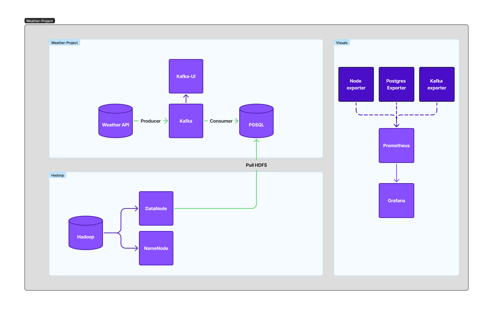

## Projet Orchestration Data Météo (Kafka → PostgreSQL → HDFS → MapReduce/HBase)

### Présentation
Pipeline de données temps réel et batch autour de la météo:
- Producer récupère les données OpenWeather et les envoie dans Kafka.
- Consumer lit Kafka et persiste les messages dans PostgreSQL (JSONB).
- Un job d’export pousse périodiquement les données de PostgreSQL vers HDFS (partition journalière).
- Un job MapReduce Python agrège les métriques (températures, précipitations, qualité de l’air) et peut écrire les résultats dans HBase.
- Monitoring via Prometheus et Grafana, Kafka UI pour l’observation des topics.

### Architecture (services principaux)
- Kafka (mode KRaft) + Kafka UI
- PostgreSQL + postgres-exporter (Prometheus)
- Producer Python (OpenWeather → Kafka)
- Consumer Python (Kafka → PostgreSQL)
- Hadoop (NameNode + DataNode) exposant WebHDFS
- Export PostgreSQL → HDFS (Python)
- MapReduce Python (HDFS → agrégats → HDFS et optionnellement HBase)
- HBase (optionnel, via Thrift pour HappyBase)
- Prometheus + Grafana




Flux de données:
1) OpenWeather → Producer → Kafka topic `weather-api`
2) Kafka → Consumer → table PostgreSQL `weather`
3) PostgreSQL → Export Python → HDFS `/user/hdfs/weather/dt=YYYY-MM-DD/weather_*.json`
4) HDFS → MapReduce Python → `aggregates.jsonl` (+ option HBase)

---

## Prérequis
- Docker et Docker Compose
- Ansible (pour le déploiement automatisé)
- Accès Internet (API OpenWeather)

Facultatif pour tests/CLI:
- Python 3.12+ si vous souhaitez exécuter localement les scripts

---

```

Note: Les rôles Ansible référencent des templates `.env.j2`. S’ils ne sont pas fournis, utilisez le bloc ci-dessus pour générer manuellement un `.env` sur la machine cible.

---

## Déploiement avec Ansible
Inventaire local fourni: `ansible/inventory.ini`

Commande:
```bash
ansible-playbook -i ansible/inventory.ini ansible/site.yml
```

Ce playbook applique:
- Rôle `kafka`: déploie Kafka, Kafka UI, PostgreSQL, Producer, Consumer, Prometheus, Grafana.
- Rôle `hadoop`: déploie NameNode, DataNode, HBase (optionnel), export Postgres→HDFS, MapReduce.

Le réseau Docker externe `infra-kafka` est assuré par Ansible.

---

## Détails techniques

### Producer (`producer/main.py`)
- Récupère périodiquement:
  - météo courante, prévisions 5j, qualité de l’air, précipitations, infos soleil
- Envoie un message JSON sur le topic `TOPIC_NAME` (défaut: `weather-api`) toutes les 10 minutes
- Dépend de: `OPENWEATHER_API_KEY`, `CITY`, `BOOTSTRAP_SERVERS`

### Consumer (`consumer/main.py`)
- Consomme le topic, insère dans PostgreSQL:
  - table `weather(date_time TIMESTAMP, msg_offset BIGINT, partition INT, value JSONB)`
- Convertit les timestamps en Europe/Paris

### Export PostgreSQL → HDFS (`Hadoop/pull_Hdfs.py` et `Hadoop/hadoop-pull/pull_Hdfs.py`)
- Lit les nouvelles lignes depuis la dernière exécution (table `REF_DATE`)
- Écrit des fichiers `weather_*.json` en JSON Lines sous `HDFS_BASE_PATH/dt=YYYY-MM-DD`
- Utilise WebHDFS via `InsecureClient`

### MapReduce Python (`Hadoop/MapReduce/MapReduce.py`)
- Lit les fichiers HDFS de la partition du jour (ou toutes si configuré)
- Calcule: moy/min/max température, sommes précipitations (1h/3h), moyenne AQI
- Écrit `aggregates.jsonl` dans la partition
- Optionnel: écrit chaque agrégat en HBase (`weather:aggregates`, cf `HBASE_*`)

### Monitoring
- Prometheus scrape:
  - `postgres-exporter:9187`
  - `kafka:9092` (note: pour des métriques Kafka plus riches, prévoir un exporter dédié)
- Grafana: admin/admin par défaut

---

## Accès aux services (ports par défaut)
- Kafka: 9092 (broker), 9093 (controller interne)
- Kafka UI: http://localhost:8080
- PostgreSQL: 5432
- Prometheus: http://localhost:9090
- Grafana: http://localhost:3000 (admin/admin)
- HDFS NameNode Web UI: http://localhost:9870
- HBase Web UI Master: http://localhost:16010 (si activé)

---

## Lancement rapide (résumé)
1) Créez un `.env` complet (voir exemple plus haut).
2) Exécutez:
```bash
ansible-playbook -i ansible/inventory.ini ansible/site.yml
```
3) Vérifiez les UIs (Kafka UI, Grafana, Prometheus, HDFS UI).

---

## Dépannage (FAQ)
- Kafka non prêt / consumer en attente:
  - Vérifier la santé du conteneur Kafka, la variable `BOOTSTRAP_SERVERS` et le réseau `infra-kafka`.
- Aucune donnée dans PostgreSQL:
  - Vérifier la clé `OPENWEATHER_API_KEY` et l’accès Internet; contrôler les logs du producer.
- Export HDFS échoue:
  - Vérifier `HDFS_URL` et l’UI du NameNode; attendre que WebHDFS soit up (le code attend automatiquement).
- MapReduce ne produit rien:
  - Vérifier qu’il y a des fichiers `weather_*.json` dans la partition du jour; sinon désactiver `MR_PROCESS_ONLY_TODAY`.
- HBase indisponible:
  - Mettre `HBASE_ENABLED=false` ou vérifier `HBASE_HOST/PORT` et la présence du service Thrift.

---

## Notes
- Les fichiers de rôles Ansible référencent des templates `.env.j2` non inclus: pensez à créer le `.env` à la main sur la cible ou à ajouter vos templates.
- Les volumes Docker persisteront les données Kafka/PostgreSQL/HDFS entre redéploiements.
- Le topic Kafka par défaut est `weather-api` (auto-création activée côté broker).

