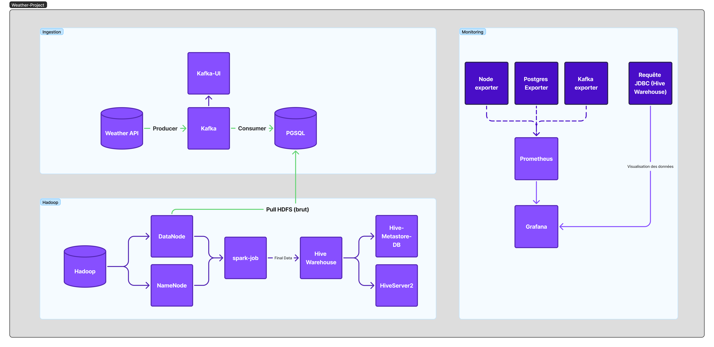

## Projet Orchestration Data Météo 

### Présentation
Pipeline de données temps réel et batch autour de la météo:
- Producer récupère les données OpenWeather et les envoie dans Kafka.
- Consumer lit Kafka et persiste les messages dans PostgreSQL (JSONB).
- Un job d’export pousse périodiquement les données de PostgreSQL vers HDFS (partition journalière).
- Un job Python ingère les fichiers HDFS dans Hive (via HiveServer2 avec PyHive).
- Monitoring via Prometheus et Grafana, Kafka UI pour l’observation des topics.

### Architecture (services principaux)
- Kafka (mode KRaft) + Kafka UI
- PostgreSQL + `postgres-exporter` (Prometheus)
- Producer Python (OpenWeather → Kafka)
- Consumer Python (Kafka → PostgreSQL)
- Hadoop (NameNode + DataNode) exposant WebHDFS
- Export PostgreSQL → HDFS (Python, `pull_Hdfs.py`)
- Spark job → Hive (Spark + HiveServer2)
- Prometheus + Grafana + exporters (Kafka, Node, PostgreSQL)




Flux de données:
1) OpenWeather → Producer → Kafka topic `weather-api`
2) Kafka → Consumer → table PostgreSQL `weather`
3) PostgreSQL → Export Python (`pull_Hdfs.py`) → HDFS `/user/hdfs/weather/dt=YYYY-MM-DD/weather_*.json`
4) HDFS → Job Spark/Python → Hive (base `weather`, table `events` en Parquet)

---

## Prérequis
- **Docker** et **Docker Compose**
- **Ansible** (pour le déploiement automatisé)
- **Accès Internet** (API OpenWeather)

Facultatif pour tests/CLI:
- **Python 3.12+** si vous souhaitez exécuter localement les scripts

---

### Gestion des fichiers `.env`

- Chaque **rôle Ansible** (`ingestion`, `hadoop`, `monitoring`, etc.) dispose de son propre template `templates/.env.j2`.
- Les valeurs sont injectées à partir des fichiers `vars/main.yml` du rôle correspondant.
- À terme, ces `vars/main.yml` sont pensés pour être **écrasés par une GitHub Action** alimentée par les *secrets* du repository (pas de secrets en clair dans le code / README).

Pour connaître la liste exacte des variables (OpenWeather, Kafka, PostgreSQL, HDFS, Hive…), se référer à:
- `ansible/roles/*/vars/main.yml`
- `ansible/roles/*/templates/.env.j2`

---

## Déploiement avec Ansible
Inventaire local fourni: `ansible/inventory.ini`

Commande:
```bash
ansible-playbook -i ansible/inventory.ini ansible/site.yml
```

Ce playbook applique:
- Rôle `kafka` (ingestion): déploie Kafka, Kafka UI, PostgreSQL, Producer, Consumer.
- Rôle `hadoop`: déploie NameNode, DataNode, Spark (`spark-master`, `spark-worker`, `spark-job`), export Postgres→HDFS, ingestion HDFS→Hive.
- Rôle `monitoring`: déploie Prometheus, Grafana et les exporters (PostgreSQL, Kafka, Node).

Le réseau Docker externe `infra-kafka` est assuré par Ansible.

---

## Détails techniques

### Ansible (infrastructure as code)
- L’orchestration complète est décrite dans Ansible, point d’entrée : `ansible/site.yml`.
- Trois rôles principaux :
  - `roles/ingestion` : Kafka, PostgreSQL, producer, consumer, bootstrap des données.
  - `roles/hadoop` : Hadoop (NameNode/DataNode), WebHDFS, Hive (metastore + HiveServer2), Spark (`spark-job`), export PostgreSQL → HDFS.
  - `roles/monitoring` : Prometheus, Grafana, exporters (PostgreSQL, Kafka, Node).
- Chaque rôle :
  - possède son propre `docker-compose.yml` et ses templates `templates/.env.j2`,
  - est paramétré via `vars/main.yml` (surchargé ensuite par la CI/GitHub Actions si besoin),
  - est appelé depuis `site.yml` pour permettre un déploiement complet via une **seule commande** `ansible-playbook`.

### Fréquences d’exécution (batch 10 minutes)
- **Export API Weather → Kafka → PostgreSQL**:
  - le producer interroge l’API OpenWeather et envoie les messages dans Kafka toutes les **10 minutes**.
- **Export PostgreSQL → HDFS (`pull-hdfs`)**:
  - le job `pull_Hdfs.py` lit périodiquement PostgreSQL et pousse les nouveaux enregistrements dans HDFS toutes les **10 minutes**.
- **Nettoyage + insertion vers Hive (`spark-job`)**:
  - le conteneur `spark-job` lit les nouveaux fichiers HDFS et alimente la table Hive `weather.events` toutes les **10 minutes**.

### Modèle de données PostgreSQL
- **Table `weather`**:
  - stocke les messages bruts reçus de Kafka sous forme de JSON (`value` en `JSONB`) avec le timestamp, l’offset et la partition.
- **Table `REF_DATE`**:
  - conserve, par application, le dernier timestamp d’export traité (watermark),
  - utilisée par `pull-hdfs` et `spark-job` pour ne traiter **que les nouvelles données** à chaque exécution (toutes les 10 minutes) et éviter les doublons vers HDFS ou Hive.

### Producer (`producer/main.py`)
- Récupère périodiquement:
  - météo courante, prévisions 5j, qualité de l’air, précipitations, infos soleil
- Envoie un message JSON sur le topic `TOPIC_NAME` (défaut: `weather-api`) toutes les 10 minutes
- Dépend de: `OPENWEATHER_API_KEY`, `CITY`, `BOOTSTRAP_SERVERS`

### Consumer (`consumer/main.py`)
- Consomme le topic, insère dans PostgreSQL:
  - table `weather(date_time TIMESTAMP, msg_offset BIGINT, partition INT, value JSONB)`
- Convertit les timestamps en Europe/Paris

### Export PostgreSQL → HDFS (`Hadoop/pull_Hdfs.py` et `Hadoop/hadoop-pull/pull_Hdfs.py`)
- Lit les nouvelles lignes depuis la dernière exécution (table `REF_DATE`)
- Écrit des fichiers `weather_*.json` en JSON Lines sous `HDFS_BASE_PATH/dt=YYYY-MM-DD`
- Utilise WebHDFS via `InsecureClient`

### Ingestion HDFS → Hive (Spark + HiveServer2)
- Le conteneur `spark-job` exécute en continu le script `ansible/roles/hadoop/files/spark_transform/json_to_hive_daemon.py`.
- Le job :
  - parcourt récursivement les partitions `dt=*` sous `HDFS_BASE_PATH` (`/user/hdfs/weather/dt=YYYY-MM-DD`),
  - lit les fichiers `.json` en JSON Lines produits par l’export PostgreSQL,
  - « aplatit » la structure JSON OpenWeather pour en extraire les champs utiles (ville, coordonnées, timestamps, température, humidité, vent, description météo, etc.),
  - écrit les données nettoyées dans une table Hive **`weather.events`** au format **Parquet** sous `hdfs://namenode:8020/user/hive/warehouse/weather.db/events`.
- Colonnes principales de `weather.events` (simplifié) :
  - `city_id`, `city_name`, `lat`, `lon`
  - `obs_ts_utc`, `sunrise_utc`, `sunset_utc`
  - `temp`, `feels_like`, `temp_min`, `temp_max`, `pressure`, `humidity`
  - `wind_speed`, `wind_deg`
  - `weather_code`, `weather_main`, `weather_description`, `weather_icon`
  - `timezone_offset_seconds`, `raw_payload` (JSON complet en backup)
- Accès Hive:
  - via HiveServer2 (`hive-server`, port 10000) avec Beeline, DBeaver, PyHive, Spark SQL, etc.
  - exemple de requête d’agrégation:

### Monitoring
- Prometheus scrape:
  - `postgres-exporter:9187`
  - `kafka-exporter:9308`
  - `node-exporter:9100`
  - `kafka:9092` (note: pour des métriques Kafka plus riches, prévoir un exporter dédié)
- Grafana: admin/admin par défaut

---

## Accès aux services (ports par défaut)
- Kafka: 9092 (broker), 9093 (controller interne)
- Kafka UI: http://localhost:8080
- PostgreSQL: 5432
- Prometheus: http://localhost:9090
- Grafana: http://localhost:3000 (admin/admin)
- HDFS NameNode Web UI: http://localhost:9870


---

## Lancement rapide (résumé)
1) Renseignez les variables nécessaires dans `ansible/roles/*/vars/main.yml` (ou laissez votre CI/GitHub Action les injecter via les secrets) : les rôles généreront automatiquement leurs `.env` à partir des templates `.env.j2`.
2) Exécutez:
```bash
ansible-playbook -i ansible/inventory.ini ansible/site.yml
```
3) Vérifiez les UIs (Kafka UI, Grafana, Prometheus, HDFS UI).

---

## Troubleshooting (FAQ)

- Erreur de format de script dans le conteneur Spark (`spark-job`):
  - Symptôme: l’entrée `entrypoint.sh` n’est pas exécutée correctement (erreur de format / `^M` dans le script).
  - Cause probable: fichier avec fins de lignes Windows (CRLF) au lieu de Unix (LF).
  - Solution (dans le conteneur `spark-job`):
    1. Installer `dos2unix`:
    2. Convertir les scripts en format Unix:
       ```bash
       dos2unix /ansible/roles/hadoop/files/spark_transform/entrypoint.sh
       dos2unix /opt/hadoop/jobs/entrypoint.sh
       ```


---

## Notes

- Les volumes Docker persisteront les données Kafka/PostgreSQL/HDFS entre redéploiements.
- Le topic Kafka par défaut est `weather-api` (auto-création activée côté broker).

